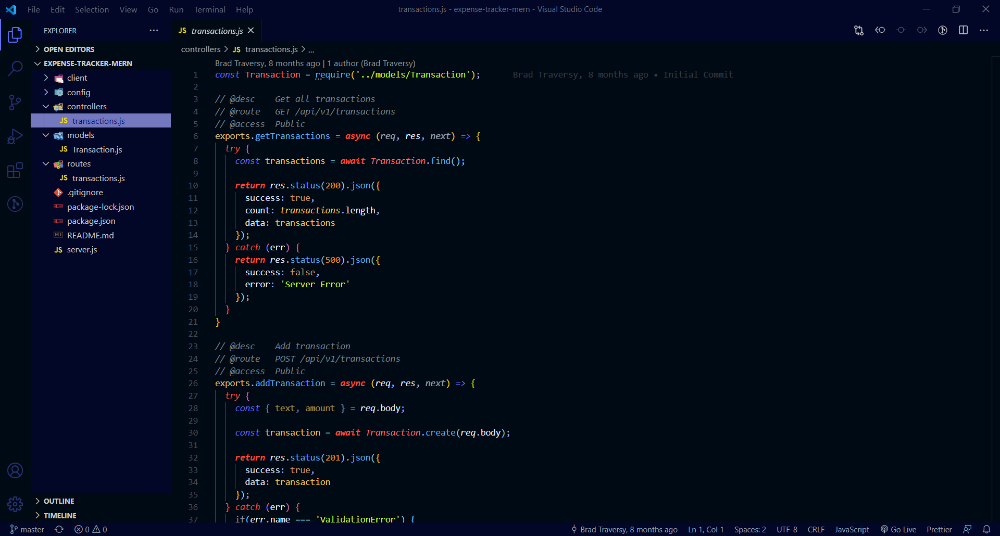
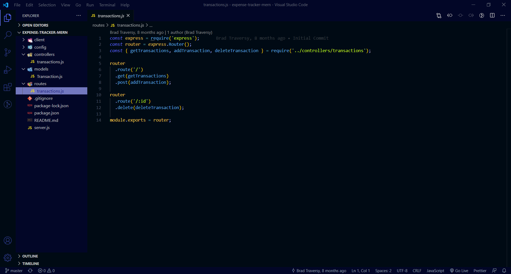

# GELAP

<h2>This is Gelap, a theme extension for VSCode.</h2>

 

<h3>Simple. Dark. Tranquille</h3>

 

<h3>The contrast-blueish color will make you feel calm while energetic in the same time</h3>

 

<h3>Feel free to contribute on the theme or documentation <a align="center" href="https://github.com/ryanadhi/gelap">here</a></h3>

 
 

<h3>Screenshot</h1>

 

 

 
 

Most part of JSON theme file are from **One Dark Pro** ([source](https://marketplace.visualstudio.com/items?itemName=zhuangtongfa.Material-theme)) with some tweaks.

**Enjoy!**
